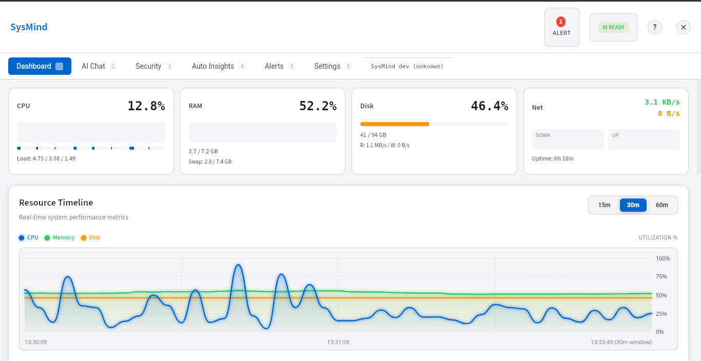
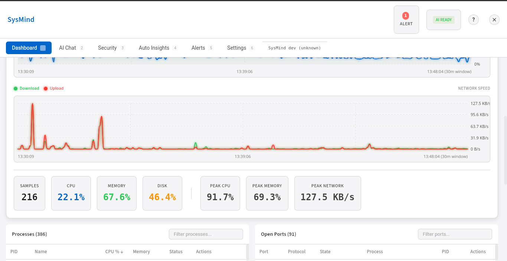
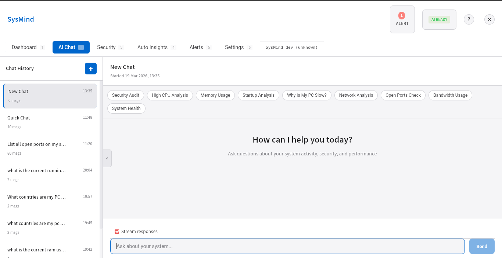
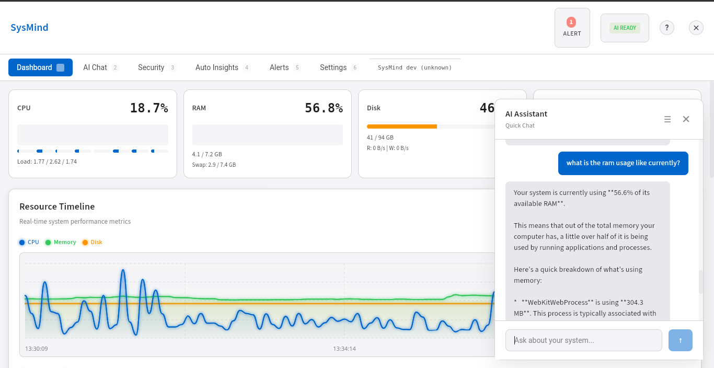
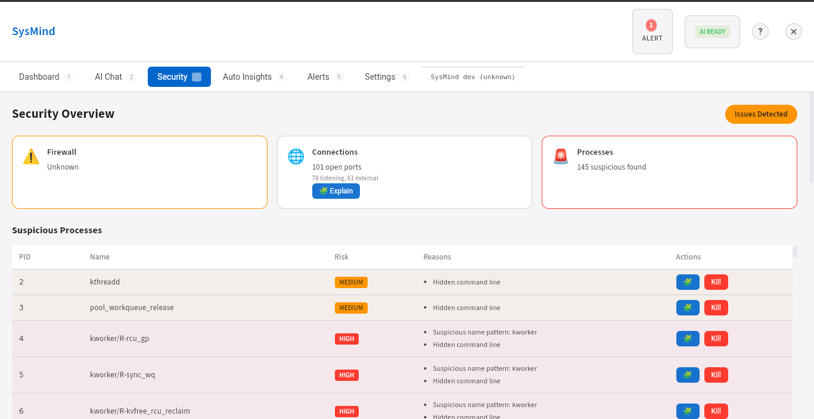
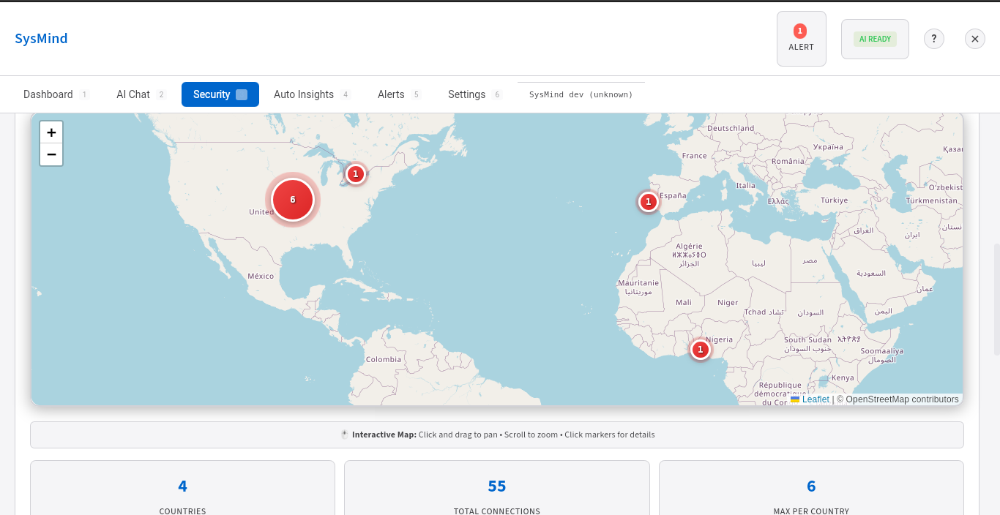
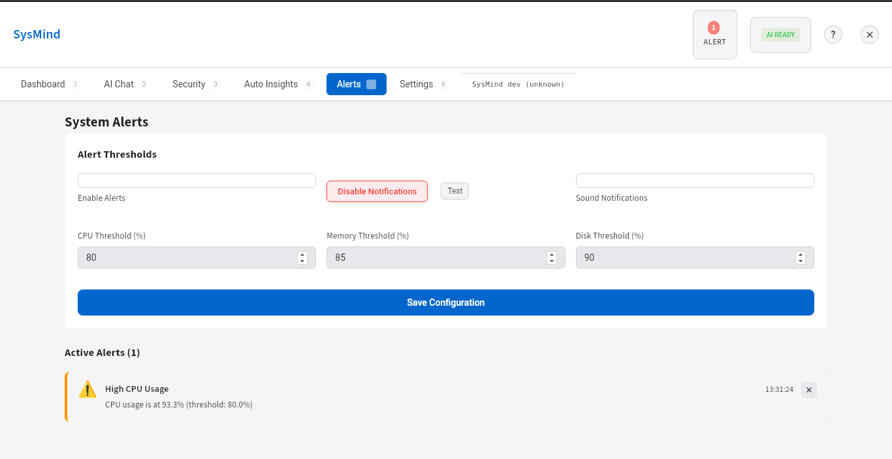
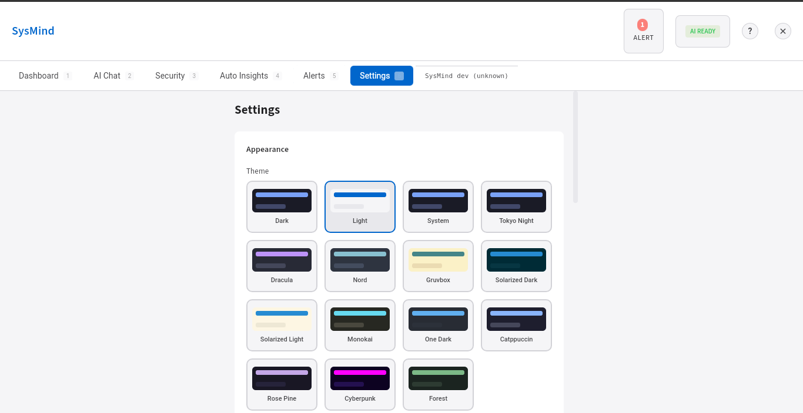

# SysMind

<div align="center">


**AI-powered system monitoring assistant that helps you understand what your computer is doing in real-time.**

[](https://opensource.org/licenses/MIT)
[](https://golang.org/)
[](https://wails.io/)
[](https://reactjs.org/)

[Features](#-features) •
[Installation](#-installation) •
[Usage](#-usage) •
[Contributing](#-contributing) •
[License](#-license)

</div>

## Overview

SysMind is a cross-platform desktop application built with Go and Wails that provides intelligent system monitoring with AI-powered insights. Get real-time information about your system processes, network activity, and resource usage, then ask natural language questions to understand what's happening.

## ✨ Features

### 🖥️ **System Dashboard**
- **Process Monitoring**: View all running processes with CPU and memory usage
- **Network Analysis**: Monitor open ports (TCP/UDP) with associated processes  
- **Resource Timeline**: Real-time charts showing CPU, memory, disk, and network usage with customizable time windows (15m, 30m, 60m)
- **Disk Monitoring**: Real-time disk usage percentage, used/total capacity, and disk I/O speeds
- **Bandwidth Tracking**: Network usage per application with upload/download speeds
- **System Stats Cards**: Real-time CPU, RAM, and network metrics with mini-trend graphs
- **Auto-refresh**: Live updates every 3-5 seconds

### 🤖 **AI-Powered Insights**
- **Natural Language Queries**: Ask questions about your system in plain English
- **Smart Analysis**: Get explanations about system activity and performance
- **Security Assessment**: Identify potential issues or suspicious behavior
- **Performance Optimization**: Recommendations for system improvements
- **Quick Chat (Ctrl+K)**: Floating AI assistant panel for quick queries without leaving current tab
- **Chat Sessions**: Create, manage, and switch between multiple conversation sessions

### 🔌 **AI Provider Support**
- **OpenAI**: GPT-4, GPT-4 Turbo, GPT-3.5 Turbo
- **Anthropic**: Claude 3.5 Sonnet, Claude 3 Opus, Claude 3 Haiku
- **Google Gemini**: Gemini 2.0 Flash, Gemini 1.5 Pro, Gemini 1.5 Flash
- **GitHub Copilot**: GPT-4o with GitHub Copilot subscription
- **Cloudflare Workers AI**: Llama 3.1, Llama 3, Mistral 7B
- **Zhipu GLM (Z.AI)**: GLM-4-Plus, GLM-4-Air, GLM-4-Long
- **Moonshot Kimi**: Moonshot-v1-8k, Moonshot-v1-32k, Moonshot-v1-128k
- **Local LLM**: Ollama support (Llama 3, Mistral, Code Llama, etc.)
- **Flexible Configuration**: Easy switching between providers

## 🔐 Privacy & Data Sharing

SysMind is designed with your privacy in mind. You have complete control over what system information is shared with your AI provider.

### Data Collection Transparency

SysMind collects the following system data for analysis:
- **Process Information**: Running process names, CPU/memory usage
- **Network Information**: Open ports, listening services, remote IP connections
- **System Statistics**: Overall CPU, memory, and disk usage percentages
- **Security Alerts**: Firewall status and suspicious process detection

### Data Privacy Assurances

The following information is **NEVER collected or shared**:
- ✅ Command line arguments
- ✅ Usernames and user IDs
- ✅ File contents or paths
- ✅ Passwords or authentication tokens
- ✅ Environment variables
- ✅ SSL/TLS certificates

### Privacy Settings

SysMind includes granular privacy controls in Settings → Privacy & Data Sharing:

#### Data Sharing Controls
1. **Share Process Names** - Allow AI to see what programs are running
2. **Share Process Details** - Allow AI to see CPU/memory per process
3. **Share Network Ports** - Allow AI to see open ports and listening services
4. **Share Connection IPs** - Allow AI to see remote IP addresses
5. **Share Connection Locations** - Allow AI to see geographic location of connections
6. **Share Security Alerts** - Allow AI to see security warnings and suspicious processes
7. **Share System Statistics** - Allow AI to see overall CPU/memory/disk percentages

#### Anonymization Options
- **Anonymize Process Names** - Replace real process names with categories:
  - `[Browser]` - Firefox, Chrome, Safari, Edge, Brave, etc.
  - `[Dev Tool]` - Code, Node, Python, Git, etc.
  - `[Communication]` - Slack, Teams, Discord, Zoom
  - `[Media]` - Spotify, VLC, etc.
  - `[System]` - System processes
  - `[Database]` - PostgreSQL, MySQL, Redis
  - `[Application]` - Other applications

- **Anonymize Connection IPs** - Replace IP addresses with service categories:
  - `[Google Services]` - Google, YouTube, etc.
  - `[AWS Cloud]` - Amazon Web Services
  - `[Microsoft/Azure]` - Microsoft and Azure services
  - `[Cloudflare CDN]` - Cloudflare CDN
  - `[Fastly CDN]` - Fastly CDN
  - `[GitHub]` - GitHub services
  - `[Meta/Facebook]` - Meta and Facebook services
  - `[External Server]` - Unknown services

### Default Behavior

By default, all privacy settings are enabled (data sharing turned on, anonymization off) for optimal AI analysis while maintaining transparency:
- All system data is shared with your AI provider
- Process names and IP addresses are shared in their original form
- You can customize these settings at any time

### How to Use Privacy Settings

1. Open SysMind and go to **Settings**
2. Scroll to **Privacy & Data Sharing** section
3. Toggle individual settings to control what data is shared:
   - ✓ Checkmark = Data is shared
   - ✗ Unchecked = Data is NOT shared
4. Enable anonymization options to replace sensitive information with categories
5. Click **Save Privacy Settings** to apply your preferences

When anonymization is enabled, SysMind intelligently replaces specific information with categories while maintaining analytical value for AI insights.

### 🌍 Cross-Platform
- **Linux**: Native `/proc` filesystem integration
- **macOS**: Uses `lsof` and system APIs  
- **Windows**: Leverages `netstat` and WMI

## 🎨 UI Overview

SysMind features a modern, dark-themed interface with intuitive navigation and real-time data visualization.

### Dashboard Tab

| | |
|---|---|
|  |  |

The main dashboard provides at-a-glance system monitoring:
- **System Stats Cards** (Top Row)
  - Real-time CPU usage with per-core breakdown
  - Memory/RAM usage with swap information
  - Disk usage with I/O speeds (read/write)
  - Network activity with upload/download speeds
- **Resource Timeline Charts** (Middle Section)
  - CPU, Memory, and Disk utilization trends
  - Network bandwidth timeline (upload/download)
  - Customizable time windows (15m, 30m, 60m)
  - Smooth area charts with historical data
- **Process List** (Bottom Section)
  - Sortable table of running processes
  - Filter by process name
  - CPU %, Memory usage, and status
  - Kill process or adjust priority options
  - Click to expand detailed process information
- **Open Ports** (Bottom Section)
  - Monitor all listening and established connections
  - Port number, protocol, associated process
  - Filter connections by process name
  - View socket state and process details

### AI Chat Tab



Full-featured chat interface for system queries:
- **Chat Sessions Panel**
  - Create new conversation sessions
  - Switch between previous conversations
  - Session history persists across restarts
- **Message Display**
  - User queries appear on the right
  - AI responses on the left with clear formatting
  - Real-time streaming responses
  - Loading spinner while AI is thinking
- **Input Area**
  - Single-line message input
  - Send button or press Enter to submit
  - Multiline support for complex queries

### Quick Chat Panel (Ctrl+K)



Floating AI assistant for quick queries:
- **Floating Window**
  - Slides in from the right side
  - No background dimming - stays transparent
  - Fixed size with smooth animations
- **Session Menu**
  - Hamburger icon (☰) to access chat sessions
  - Quick dropdown list of previous chats
  - Switch sessions without closing panel
- **Compact Interface**
  - Minimalist design with essential controls
  - Close button (✕) to hide panel
  - Escape key to dismiss
  - Always-on-top positioning

### Security Tab

| | |
|---|---|
|  |  |

System security analysis:
- **Firewall Status** indicator
- **Suspicious Process Detection**
  - AI-identified potentially dangerous processes
  - Detailed risk assessment
- **Network Connection Analysis**
  - External connections mapped to processes
  - Geographic location of remote servers
  - Helps identify unexpected outbound traffic

### Alerts Tab



System notifications and warnings:
- **Alert List** with filtering
- **Severity Levels**: Info, Warning, Critical
- **Alert Types**: CPU, Memory, Disk, Network, Security
- **Dismiss** individual alerts
- **Audio/Desktop Notifications** (when enabled)

### Settings Tab

| | |
|---|---|
|  | |

Configuration and preferences:
- **AI Provider Selection**
  - Choose between 8 different AI providers
  - OpenAI, Anthropic, Google Gemini, GitHub Copilot, Cloudflare Workers AI, Zhipu GLM, Moonshot Kimi, Local LLM
- **API Configuration**
  - Enter API keys and account information
  - Select preferred model for each provider

### Theme & Design

| | |
|---|---|
|  | |

- **Dark Theme** (Primary): Dark blue/purple palette for reduced eye strain
- **Color Coding**:
  - Blue: Primary accent (CPU, healthy status)
  - Green: Success/memory
  - Yellow: Warnings (elevated resource usage)
  - Red: Critical (high resource usage, dangers)
- **Responsive Design**: Adapts to different screen sizes
- **Smooth Animations**: 300ms transitions for panels and modals

## 📋 Prerequisites

- **Go**: 1.21 or higher
- **Node.js**: 18 or higher  
- **Wails CLI**: v2 (latest)
- **Ollama**: Optional, for local AI models

## 🚀 Installation

### Pre-built Releases (Recommended)

Download and install the latest version for your platform:

#### Linux (AMD64 & ARM64)
```bash
# One-liner to download, extract, and run the latest version
curl -s https://api.github.com/repos/Anuolu-2020/sysmind/releases/latest \
| grep "browser_download_url.*linux-$(uname -m | sed 's/x86_64/amd64/;s/aarch64/arm64/').tar.gz" \
| cut -d : -f 2,3 | tr -d \" | wget -qi - -O sysmind.tar.gz \
&& tar -xzf sysmind.tar.gz && chmod +x sysmind && ./sysmind
```

#### macOS (Intel & Apple Silicon)
```bash
# One-liner to download, extract, and run the latest version
curl -s https://api.github.com/repos/Anuolu-2020/sysmind/releases/latest \
| grep "browser_download_url.*darwin-$(uname -m | sed 's/x86_64/amd64/;s/aarch64/arm64/').tar.gz" \
| cut -d : -f 2,3 | tr -d \" | wget -qi - -O sysmind.tar.gz \
&& tar -xzf sysmind.tar.gz && chmod +x sysmind && ./sysmind
```

#### Windows (AMD64)
1. Go to the [Latest Release](https://github.com/Anuolu-2020/sysmind/releases/latest)
2. Download `sysmind-vX.X.X-windows-amd64.zip`
3. Extract and run `sysmind.exe`

### Build from Source

For developers or custom builds:

```bash
# Install Wails CLI
go install github.com/wailsapp/wails/v2/cmd/wails@latest

# Clone the repository
git clone https://github.com/Anuolu-2020/sysmind.git
cd sysmind

# Quick setup
make setup

# Development mode
make dev

# Production build
make build
```

### Installing Built Binaries (Linux)

After building, you can install SysMind for easy access:

#### User Installation (Recommended)
Install for your user account only (~/.local):
```bash
make install-user
# Then add to PATH:
export PATH=$PATH:~/.local/bin
# Or add permanently to ~/.bashrc or ~/.zshrc
```

#### System-wide Installation
Install for all users (requires sudo):
```bash
make install-system
# Now available as 'sysmind' from any terminal
```

#### Uninstall
```bash
# Remove user installation
make uninstall-user

# Remove system installation (requires sudo)
make uninstall-system
```

After installation, SysMind will appear in your application menu and can be launched with:
```bash
sysmind
```

## ⚙️ Configuration

### OpenAI Setup
1. Get your API key from [OpenAI Platform](https://platform.openai.com/api-keys)
2. Open SysMind → Settings
3. Select "OpenAI" as provider
4. Enter your API key and choose model (GPT-4 recommended)

### Cloudflare Workers AI Setup  
1. Get API token from [Cloudflare Dashboard](https://dash.cloudflare.com/profile/api-tokens)
2. Find your Account ID in the dashboard
3. Select "Cloudflare Workers AI" in Settings
4. Enter API token, Account ID, and choose model

### Local LLM Setup (Ollama)
1. Install [Ollama](https://ollama.ai)
2. Pull a model: `ollama pull llama3.1`
3. Start server: `ollama serve`  
4. Select "Local LLM" in Settings (endpoint: `http://localhost:11434`)

### Anthropic Claude Setup
1. Get your API key from [Anthropic Console](https://console.anthropic.com/account/keys)
2. Open SysMind → Settings
3. Select "Anthropic" as provider
4. Enter your API key and choose model (Claude 3.5 Sonnet recommended)

### Google Gemini Setup
1. Get your API key from [Google AI Studio](https://aistudio.google.com/apikey)
2. Open SysMind → Settings
3. Select "Google Gemini" as provider
4. Enter your API key and choose model (Gemini 2.0 Flash recommended)

### GitHub Copilot Setup
1. Ensure you have a [GitHub Copilot subscription](https://github.com/features/copilot)
2. Get your authentication token (via GitHub CLI or personal access token)
3. Open SysMind → Settings
4. Select "GitHub Copilot" as provider
5. Enter your token and choose model

### Zhipu GLM (Z.AI) Setup
1. Get your API key from [Z.AI Platform](https://www.bigmodel.cn/usercenter/apikeys)
2. Open SysMind → Settings
3. Select "Zhipu GLM" as provider
4. Enter your API key and choose model (GLM-4-Plus recommended)

### Moonshot Kimi Setup
1. Get your API key from [Moonshot Console](https://console.moonshot.cn/api-keys)
2. Open SysMind → Settings
3. Select "Moonshot Kimi" as provider
4. Enter your API key and choose model (Moonshot-v1-8k recommended)

## 💡 Usage

### Quick Chat (Ctrl+K)
Press **Ctrl+K** anywhere in the application (except in the Chat tab) to open the floating Quick Chat panel:
- Ask AI questions without leaving your current tab
- View and switch between existing chat sessions using the hamburger menu (☰)
- Create new sessions automatically when sending your first message
- Close with the ✕ button or by pressing Escape

### Chat Session Management
- Create new chat sessions in the Chat tab or through Quick Chat
- Switch between sessions to continue previous conversations
- Each session maintains its own conversation history
- Sessions persist across application restarts

### Example Queries
- *"Why is my computer running slow?"*
- *"What processes are using the most CPU?"*
- *"Is anything suspicious running on my system?"*
- *"What's using my internet connection?"*
- *"Show me all listening network ports"*
- *"Explain what this process does"*
- *"How much disk space do I have left?"*
- *"How can I optimize my system performance?"*

### Dashboard Navigation
- **Dashboard Tab (Ctrl+1)**: System overview with processes, ports, and resource timeline
- **AI Chat Tab (Ctrl+2)**: Full-featured chat interface with session management
- **Security Tab (Ctrl+3)**: Firewall status and suspicious process detection
- **Auto Insights Tab (Ctrl+4)**: AI-generated system analysis and recommendations
- **Alerts Tab (Ctrl+5)**: System alerts and notifications
- **Settings Tab (Ctrl+6)**: AI provider configuration and preferences

### Keyboard Shortcuts
- **Ctrl+1**: Dashboard
- **Ctrl+2**: AI Chat
- **Ctrl+3**: Security
- **Ctrl+4**: Auto Insights
- **Ctrl+5**: Alerts
- **Ctrl+6**: Settings
- **Ctrl+K**: Quick Chat (floating panel)
- **Shift+?**: Show keyboard shortcuts
- **Esc**: Close modals and floating panels

## 🏗️ Project Structure

```
sysmind/
├── main.go                    # Application entry point
├── app.go                     # Main app service with Wails bindings  
├── wails.json                 # Wails configuration
├── go.mod & go.sum           # Go dependencies
├── internal/
│   ├── models/               # Data structures and types
│   ├── collectors/           # Platform-specific system data collectors
│   │   ├── linux.go         # Linux implementation
│   │   ├── darwin.go        # macOS implementation  
│   │   └── windows.go       # Windows implementation
│   ├── ai/                   # AI provider implementations
│   │   ├── openai.go        # OpenAI integration
│   │   ├── cloudflare.go    # Cloudflare Workers AI
│   │   └── ollama.go        # Local LLM support
│   └── services/             # Business logic and configuration
└── frontend/
    ├── src/
    │   ├── App.jsx           # Main React component
    │   ├── components/       # UI components
    │   │   ├── Dashboard.jsx # Main dashboard  
    │   │   ├── ProcessList.jsx
    │   │   ├── PortList.jsx
    │   │   ├── ResourceTimeline.jsx
    │   │   └── ChatPanel.jsx
    │   └── style.css         # Application styles
    └── package.json          # Frontend dependencies
```

## 🔨 Building for Distribution

```bash
# Build for current platform
make build

# Build for all platforms
make cross-build

# Development commands
make dev          # Start development server
make test         # Run tests
make lint         # Run linters
make clean        # Clean build artifacts
```
## 🤝 Contributing

We welcome contributions! Please see our [Contributing Guidelines](CONTRIBUTING.md) for details.

### Quick Development Setup
```bash
# Fork and clone the repository
git clone https://github.com/Anuolu-2020/sysmind.git
cd sysmind

# Setup development environment  
make setup

# Start development
make dev
```

### Areas for Contribution
- 🐛 Bug fixes and performance improvements
- ✨ New features and AI integrations
- 📖 Documentation improvements  
- 🌍 Internationalization/translations
- 🧪 Additional test coverage
- 📦 Package managers and distribution

## 📄 License

This project is licensed under the MIT License - see the [LICENSE](LICENSE) file for details.

## 🙏 Acknowledgments

- [Wails](https://wails.io/) - Modern desktop app framework
- [React](https://reactjs.org/) - Frontend UI library
- [gopsutil](https://github.com/shirou/gopsutil) - Cross-platform system information
- [Ollama](https://ollama.ai/) - Local LLM runtime

## 📞 Support

- 🐛 **Bug Reports**: [Open an issue](https://github.com/Anuolu-2020/sysmind/issues)
- 💡 **Feature Requests**: [Discussions](https://github.com/Anuolu-2020/sysmind/discussions)  
---

<div align="center">

**⭐ If you find SysMind useful, please consider giving it a star!**

</div>
